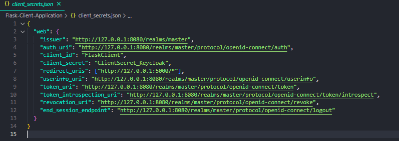
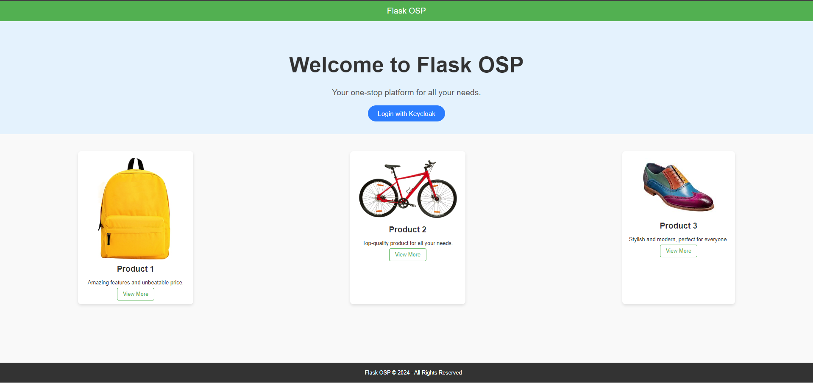
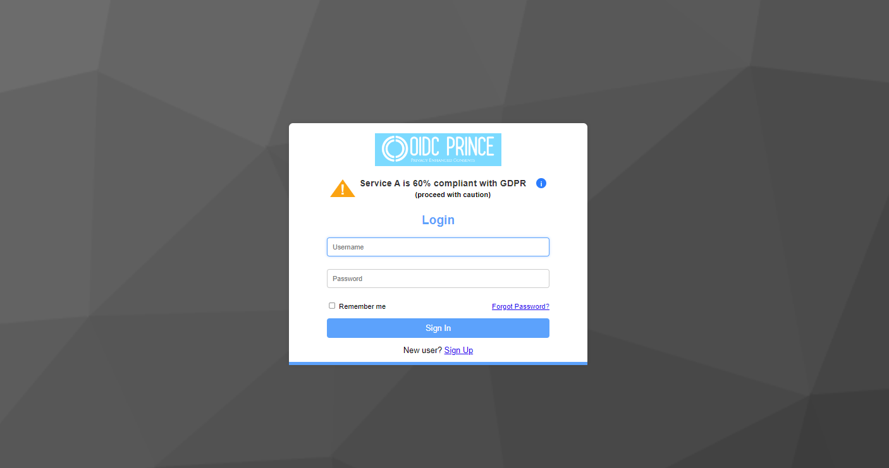
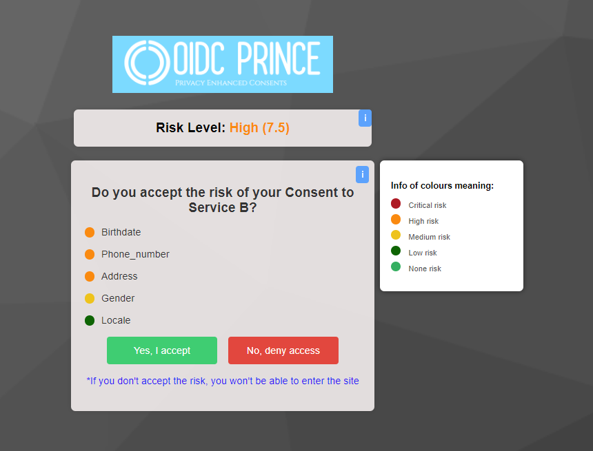
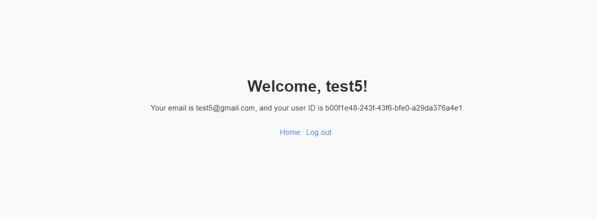
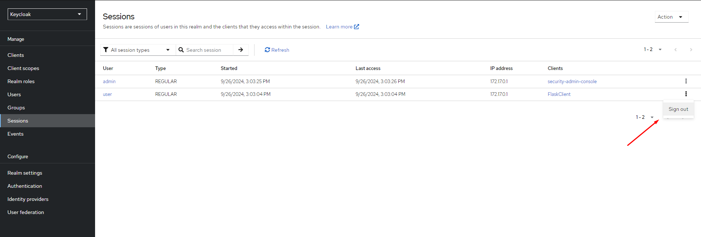

# Flask-Client-Application

This is a Flask Client Application that integrates with Keycloak to provide OAuth 2.0 and OpenID Connect (OIDC) authentication and test OIDC-PRINCE authentication project.

## Setup Instructions

It's possible to run this test application with Docker, running ``docker build -t flask-oidc-app `` and ``docker run -d -p 5000:5000 --name flask-app flask-oidc-app``, or using the instructions in the main [`README`](../)

1. If you want to create another client in Keycloak and test this application, you just need to change the variable "client_secret" in [client_secrets.json](https://github.com/OIDC-PRINCE/Flask-Client-Application/client_secrets.json) file.
   
   

2. After this configurations, you should be able to access the Aplication and make login with OIDC-PRINCE Keycloak theme:

- Open your browser and navigate to ``http://127.0.0.1:5000``
- Click Login with Keycloak to authenticate and create a new user.

  
  

  This page will only appear after you create a new user in “Sign Up”.
  

  After click in "Yes, I accept button" will appear this page, and your login with Keycloak are successfull.
  

In order to be able to create more users and log in again, you can log out the previous user.

