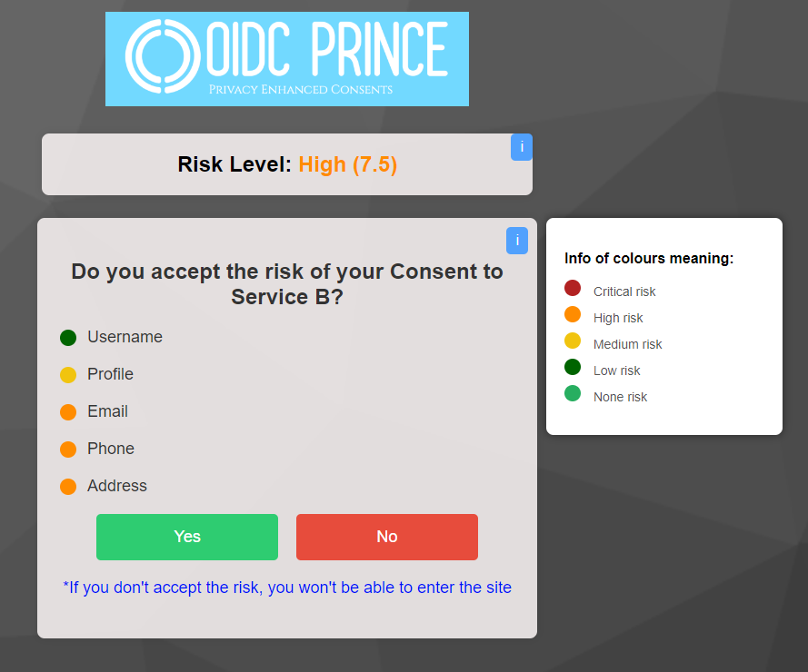

# oidc-keycloack-theme-testsversion

OIDC-PRINCE theme for Keycloak Login

In this project the claims are generated and sent randomly by the login.ftl file so that you can see a greater diversity of results on the screens where the API calculation values are received (Login screen with GDPR Compliance, and the Grant Access screen with the risk associated with each claim), together with the Flask-Client-Application, you can test the entire implementation.

## Steps do test and use OIDC Login Keycloak theme

All the Keycloak settings are have been configured beforehand, and all you have to do is run docker to enter the Keycloak interface and see the whole process.

## Some Keycloak Configurations

### Create Clients

### Create Users

### Create Client Scopes, to trigger client authentications flows

### Authentications Flows

**Explanation of how the screens interact**: three screens were developed for our theme: Login screen, Create user screen and Grant Access screen.

## Login Page Theme

## Sign Up Page Theme

## Grant Access Page Theme

To allow you to preview the screens, three .html files are provided so that you can see how the themes look without having to use Keycloak.
