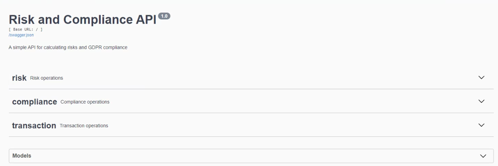
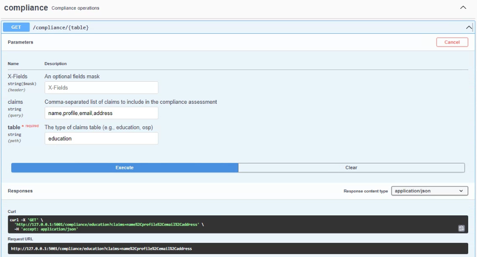
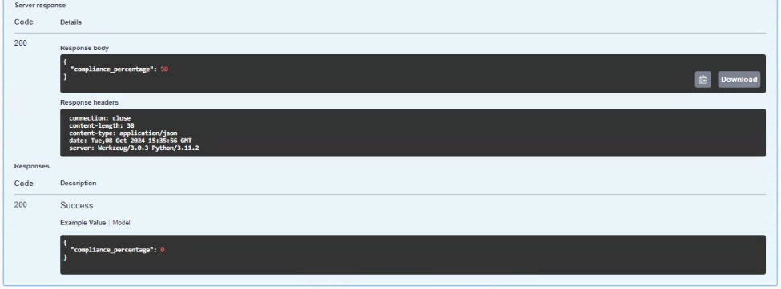
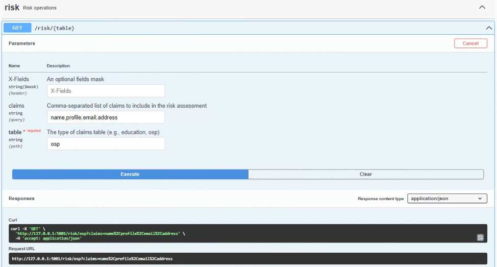
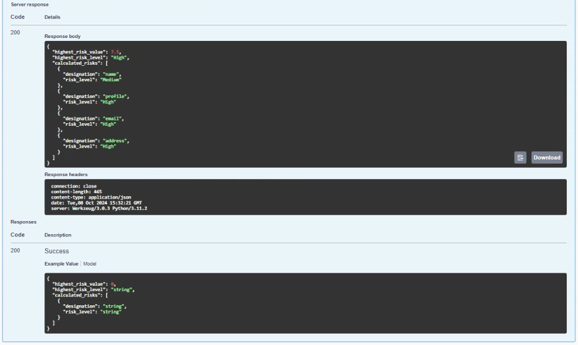
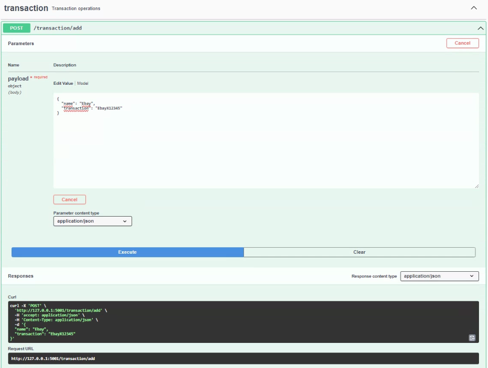
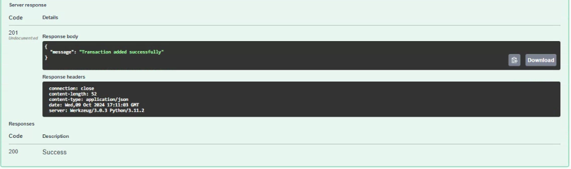
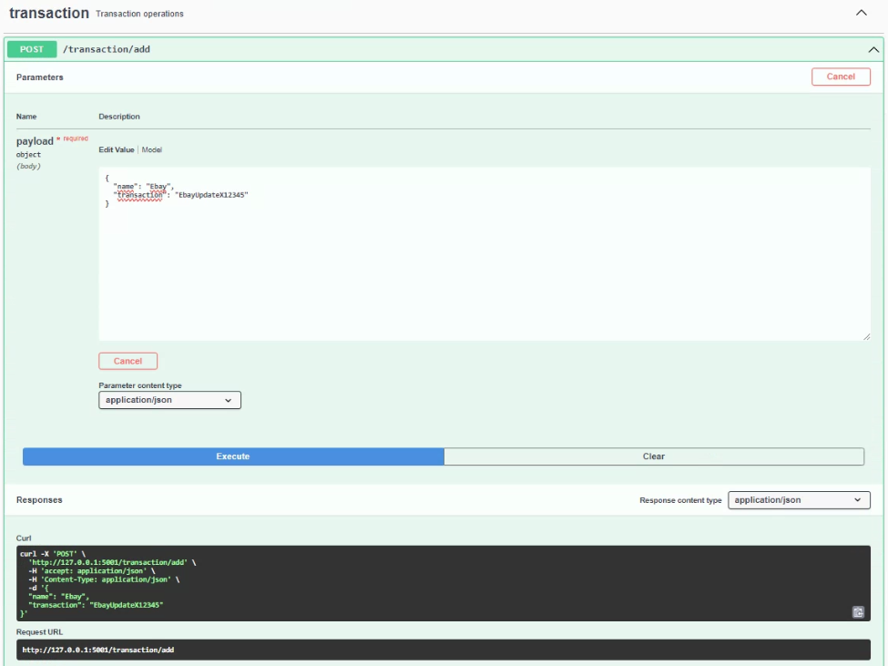
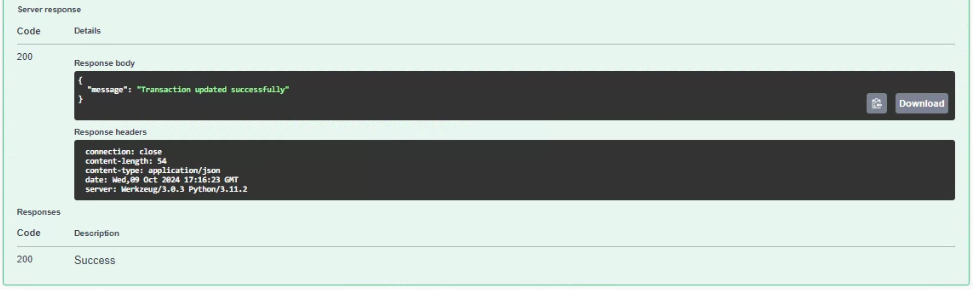
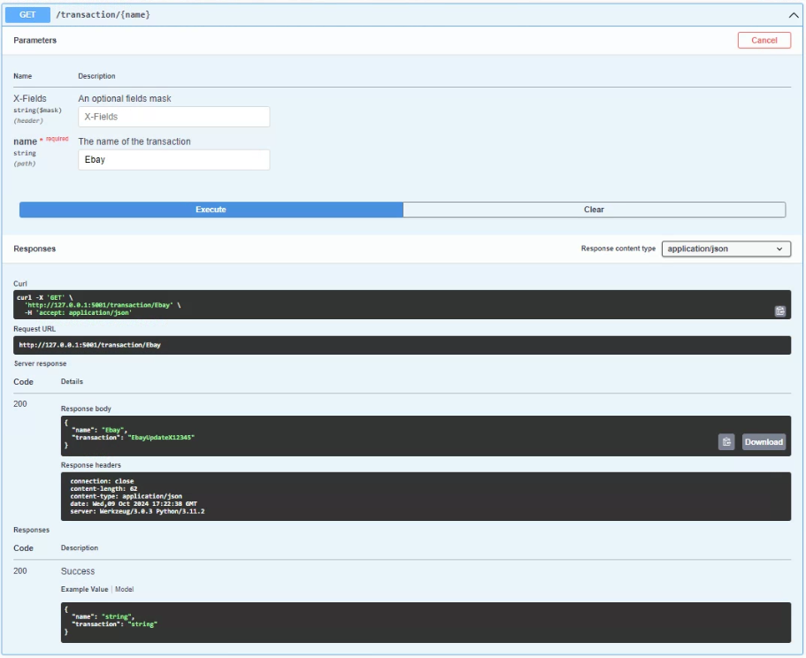

# oidc-risk-module
The OIDC risk module is composed by two major sub-components
- The risk module
- The EVM api to store information on an internal database

---------------------------------------------------------------------------------------------------------------------------------------------------------

